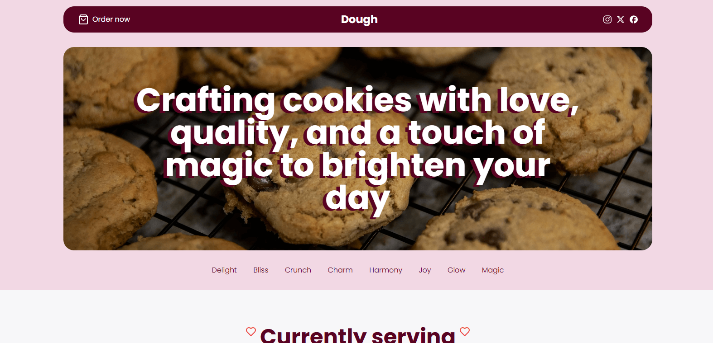

# Description 

# 🍪 Cookie Store App
This project is a fictional cookie shop website built with **Next.js**, showcasing its powerful **server-side rendering** capabilities and seamless user experience. The site features a **responsive design**, ensuring accessibility and optimal display across devices of all sizes. The warm and inviting theme reflects the essence of a cozy cookie shop, enhanced by hover animations on links and menus that add a delightful interactive touch. Perfect for exploring modern web development with Next.js and responsive design principles.

# Main Features
- **Next.js**
- **Tailwind CSS**
- **Responsive design**

# 📷 Screenshots

